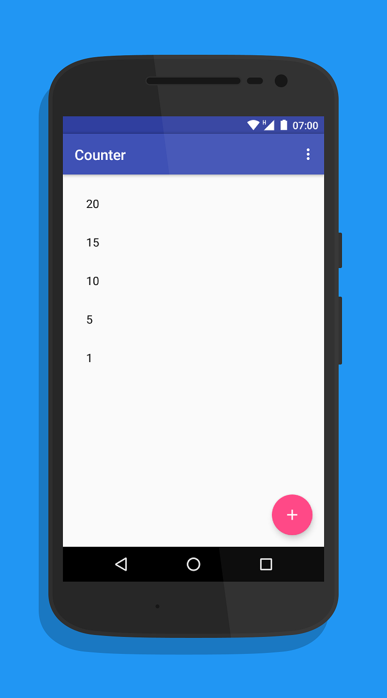
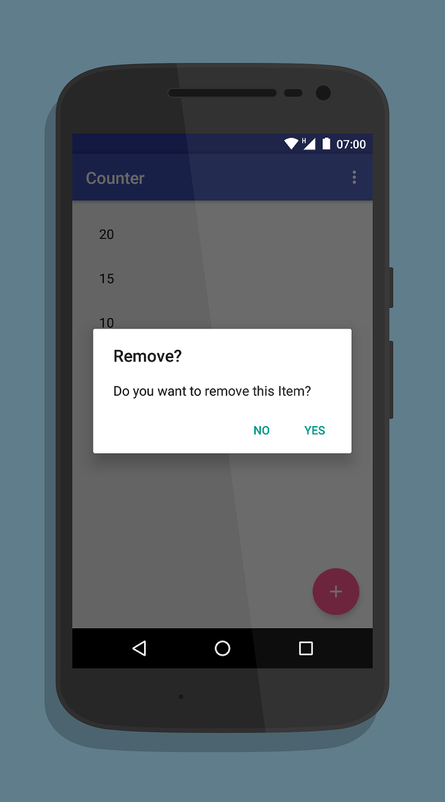

#counter-android
A simple app which helps the user with counting things.

## Usage
Press the FAB (The + Button) and a new element will appear. Press on this element and you increased the counter by one. Delete the element by long pressing on it and after confirmation, it will be deleted. Simple as that.

## Download
Google Drive (apk): https://drive.google.com/drive/folders/0B_gM44RlLpMOeTlGV1RDdkViSDg?usp=sharing  
Google Play: *WILL COME SOON*  

## Screenshots
</img>
</img>

## Support
Supported API Level: targetSdkVersion: 21 (Android 5.0+)
